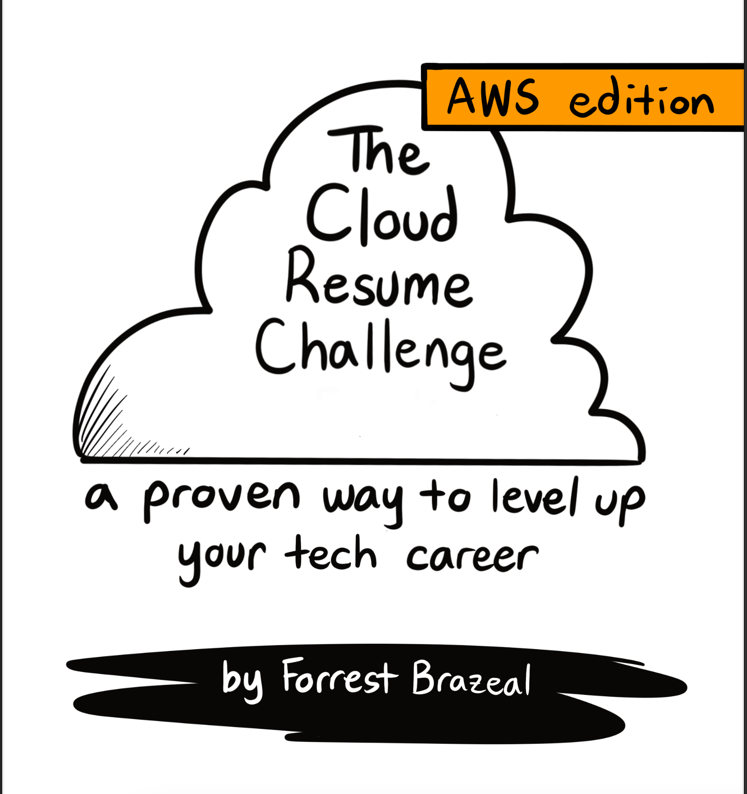

# AWS-Cloud-Resume-Challenge

## What is the AWS Cloud Resume Challenge?

[The AWS Cloud Resume Challenge](https://cloudresumechallenge.dev) is a multiple-step resume project which helps build and demonstrate skills fundamental to pursuing a career in cloud. The project was published by Forrest Brazeal.

I will attempt to complete the AWS Cloud Resume Challenge but with a twist of my own liking

## Architecture

### Services used:
* S3
* AWS Lambda
* AWS CloudFront
* Route 53
* Amazon Certificate Manager
* Dynamo DB
* Github Actions
* Terraform
* Datadog

### [Blog series](https://topsideboss2.engineer):
* What is the Cloud Resume Challenge?
* Napkin Design
* Setting up website with HTML, CSS and JavaScript
* Setting up S3 Bucket
* Setting up CloudFront
* Setting up DynamoDB
* Setting up AWS Lambda Function
* Setting up CI/CD with Github Actions
* Implementing Infrastructure as Code with Terraform
* Implementing Monitoring with Datadog

### Live Demo 🔗
